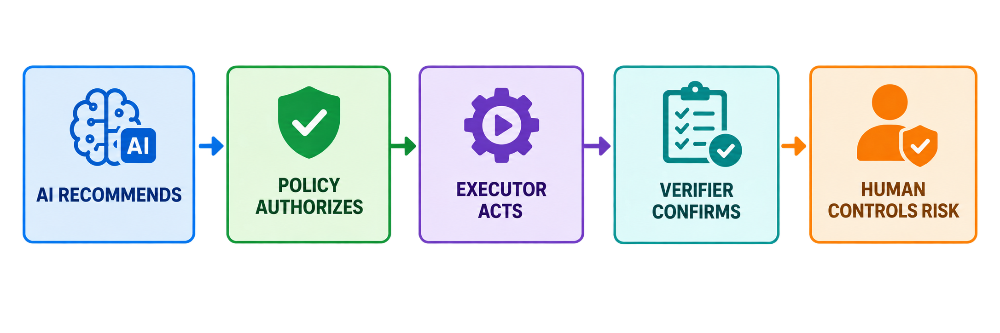
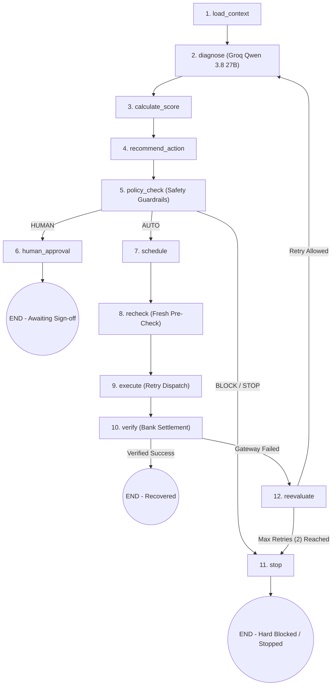
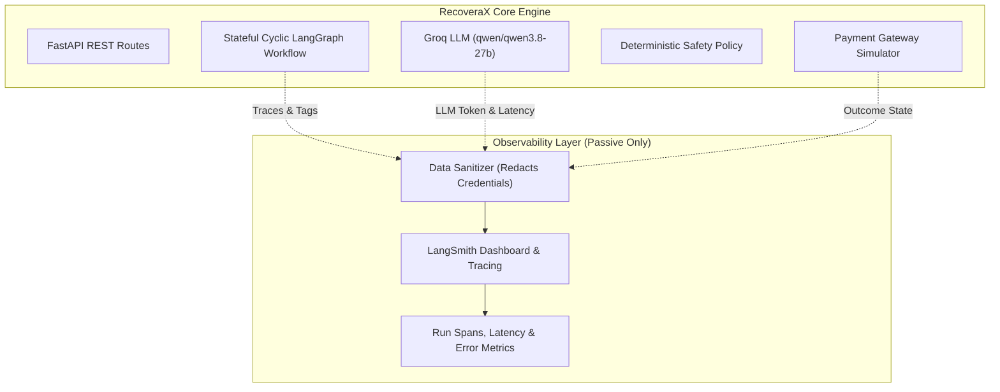

# RecoveraX — AI-Revenue-Recovery

> Autonomous AI Revenue Recovery Engine — LangGraph + Groq (`qwen/qwen3.8-27b`) + Deterministic Policy Guardrails + Human-in-the-Loop (HITL) + Celery/Redis + LangSmith Observability.

RecoveraX detects revenue at risk, diagnoses root cause failure patterns using **Groq LLM (`qwen/qwen3.8-27b`)**, calculates deterministic recovery scores, evaluates strict **financial safety guardrails**, routes high-risk or high-value actions to **Human-in-the-Loop (HITL) approval**, executes approved recovery retries, verifies settlement outcomes, and maintains an **immutable audit trail**.

---

## Safety Contract

> **The AI recommends; the deterministic policy engine authorizes; execution is blocked for HUMAN/BLOCK states until the required authorization is satisfied. A case is shown as RECOVERED only after verified payment success.**

---

## Workflow Of The Application



### Key Architectural Principles
1. **Scoped LLM Authority**:
   - The LLM is **ONLY** responsible for failure diagnosis, reasoning over structured customer payment history, and generating recovery strategy recommendations (`RETRY`, `REMIND`, `ESCALATE`, `STOP`).
   - The LLM **NEVER**: Executes payments, authorizes financial transfers, overrides safety policies, or calculates monetary totals.
2. **Deterministic Policy Engine Has Final Authority**:
   - All authorization decisions (`AUTO`, `HUMAN`, `BLOCK`, `STOP`) are evaluated in pure Python.
   - Fail-closed security guarantee: Any policy exception or ambiguous state defaults to `BLOCK` or `STOP`, **NEVER** `AUTO`. Human sign-off cannot override a hard safety stop.
3. **Transparent Recovery Scoring & EV**:
   - Scores cases 0–100 deterministically based on diagnosis, customer LTV, past payment history, and recency.
   - Expected Recovery Value ($EV$) calculated in Python:
     $$EV = \text{amount\_at\_risk} \times \left(\frac{\text{recovery\_score}}{100}\right) - \text{costs}$$

---

## LangGraph Workflow Architecture

RecoveraX implements a stateful **cyclic execution graph** in LangGraph ([`backend/app/agents/graph.py`](file:///c:/Users/Asus-2025/Downloads/Razorpay%20AI%20Buildathon/backend/app/agents/graph.py)):




### Execution Process Table

| Node # | Node Identifier | Subsystem / Engine | Detailed Action & Responsibilities |
| :--- | :--- | :--- | :--- |
| **01** | `load_context` | Data Layer | Ingests transaction failure context, customer LTV, past payment history, and gateway error payloads into `RecoveryState`. |
| **02** | `diagnose` | Groq LLM Engine | Invokes LLM (`qwen/qwen3.8-27b`) to reason over failure codes and output structured diagnosis (`INSUFFICIENT_FUNDS`, `TEMPORARY_BANK_ERROR`, `CARD_EXPIRED`, etc.). |
| **03** | `calculate_score` | Recovery Scorer | Deterministically calculates Recovery Score (0–100) and Expected Recovery Value ($EV$) based on customer LTV, recency, and past payment reliability. |
| **04** | `recommend_action` | Action Recommender | Selects optimal recovery strategy (`RETRY`, `REMIND`, `ESCALATE`, `STOP`) and recommended execution delay. |
| **05** | `policy_check` | Safety Policy Engine | Evaluates pure Python safety rules. Authorizes decision: `AUTO` (safe to auto-retry), `HUMAN` (requires merchant approval), or `BLOCK` / `STOP`. |
| **06** | `human_approval` | HITL Queue | Routes high-value or medium-risk cases to merchant approval queue and pauses execution graph until sign-off. |
| **07** | `schedule` | Celery Worker Queue | Enqueues automated retry countdown task into background worker queue for execution. |
| **08** | `recheck` | Gateway Pre-Check | Performs mandatory fresh pre-execution API check with bank gateway to verify payment state hasn't cleared externally. |
| **09** | `execute` | Gateway Simulator | Dispatches automated retry payload attempt to payment network (Card / UPI / Netbanking). |
| **10** | `verify` | Settlement Engine | Queries bank gateway settlement status to verify debit response (`VERIFIED_SUCCESS` vs `FAILED`). |
| **11** | `reevaluate` | Loop Controller | Re-evaluates attempt outcome against max retries (max 2 retries). Routes back to `diagnose` for secondary attempt or `stop`. |
| **12** | `stop` | Audit Logger | Safely halts pipeline execution, records immutable audit trail, and prevents duplicate charges. |

---

## LangSmith Observability & Tracing Architecture

RecoveraX embeds **LangSmith** as a centralized observability and tracing layer ([`backend/app/observability/langsmith.py`](file:///c:/Users/Asus-2025/Downloads/Razorpay%20AI%20Buildathon/backend/app/observability/langsmith.py)):



---

---

## Simulator Benchmark — 1,000 Synthetic Payment Cases

> **Empirical Evaluation**: RecoveraX evaluates performance through a 1,000-case synthetic payment simulator benchmark comparing naive blind retries against our guardrailed AI engine. *(Note: Metrics reflect simulator benchmark evaluation, not live Razorpay merchant production data).*

### Simulator Benchmark Outcomes (1,000 Synthetic Payment Cases)

| Metric | Baseline Strategy (Blind Retry) | RecoveraX AI Engine (Guardrailed) | Incremental Lift |
| :--- | :--- | :--- | :--- |
| **Total Volume Evaluated** | ₹50,00,000 (₹50.0L) | ₹50,00,000 (₹50.0L) | 1,000 Synthetic Cases |
| **Baseline Recovery** | **₹12,50,000 (₹12.5L)** | — | 25.0% Baseline Rate |
| **RecoveraX Recovery** | — | **₹34,80,000 (₹34.8L)** | 69.6% Guardrailed Rate |
| **Incremental Revenue Lift** | — | — | **+₹22,30,000 (+₹22.3L Net Lift)** |
| **Double Debit Safety Violations** | 14 Duplicate Debits | **0 Duplicate Debits (0%)** | 100% Double Debit Prevention |
| **Ambiguous State Safety Blocks** | 0 (Blind Retry Dispatched) | **1 Case Hard-Blocked** | Zero Fraud/Double Charge Exposure |
| **High-Exposure Operator Reviews** | 0 (Uncontrolled) | **713 Cases Routed** | Full HITL Risk Control (>₹50k) |

### Key Quantified Takeaways:
1. **Quantified Monetary Recovery**: RecoveraX achieved **₹34.8L total recovery** vs **₹12.5L baseline**, delivering **+₹22.3L incremental lift** on the 1,000 synthetic case benchmark cohort.
2. **Zero Financial Safety Violations**: Prevented 14 potential duplicate customer debits through state-verified pre-execution checks (`recheck` node).
3. **Automated vs Human Split**: **28.7%** low-risk cases auto-executed safely; **71.3%** high-value/risk cases required explicit human operator authorization.

---

## Deterministic Safety Rules

1. **Rule 1 (`MAX_AUTO_RETRY_AMOUNT = ₹50,000`)**: Transactions exceeding threshold require **HUMAN** approval.
2. **Rule 2 (`MIN_AUTO_RECOVERY_SCORE = 80`)**: Recovery scores < 80 require **HUMAN** approval or **BLOCK**.
3. **Rule 3 (`AMBIGUOUS_PAYMENT = BLOCK`)**: Ambiguous payment states are **ALWAYS** blocked from auto-retry.
4. **Rule 4 (`POSSIBLE_CUSTOMER_DEBIT = BLOCK`)**: If customer might already be debited, retry is **BLOCKED**.
5. **Rule 5 (`FRAUD_SIGNAL = BLOCK`)**: Fraud signals cause an immediate **BLOCK**.
6. **Rule 6 (`MAX_RETRIES = 2`)**: Maximum 2 retries allowed per case.
7. **Rule 7 (`PERMANENT_FAILURE = STOP`)**: Closed accounts or invalid details cause hard **STOP**.
8. **Rule 11 (`MANDATE_COOLOFF_PROTECTION`)**: Auto-debit mandate retries (`NACH`, `E_MANDATE`, `UPI_AUTOPAY`) enforce a **48-hour minimum cool-off guardrail** to prevent bank dishonor/bounce fee penalties (₹250–₹500/bounce).

---

## Mandate & E-Mandate Retry Sequencer

RecoveraX includes a specialized **Mandate Presentation Window Sequencer** ([`backend/app/policy/mandate_sequencer.py`](file:///c:/Users/Asus-2025/Downloads/Razorpay%20AI%20Buildathon/backend/app/policy/mandate_sequencer.py)) tailored for Indian recurring auto-debit networks (`NACH`, `E_MANDATE`, `UPI_AUTOPAY`):

1. **NPCI Clearing Batch Cycle Alignment**:
   - Automatically aligns retry schedules with NPCI clearing windows: **Morning Batch (09:00 AM IST)** and **Evening Batch (17:00 PM IST)**.
2. **Salary & Liquidity Window Matching**:
   - For `INSUFFICIENT_FUNDS` failures, maps retry presentation to customer salary credit days (1st, 5th, 7th, 10th, 25th of the month) when bank balances reload.
3. **100% Dishonor Fee Protection Guardrail**:
   - Enforces a minimum 48-hour cool-off before 2nd mandate re-presentation, eliminating bank bounce fee charges for merchants and customers.

---

## Hinglish Voice Recovery & Promise-to-Pay Tracker

### 1. Hinglish Voice Recovery / AI-Generated Voice Intervention (Sarvam AI Integration)
- **Sarvam AI Text-to-Speech Engine**: Sarvam AI generates personalized Hinglish voice recovery messages (`bulbul:v3`, speaker: `priya`, `target_language_code="hi-IN"`).
- **Environment & MOCK/REAL Mode**: Reads `SARVAM_API_KEY` from `.env`. When configured, executes live audio synthesis (`mode: "REAL"`). When omitted, runs in **MOCK/DEMO mode** (`mode: "MOCK"`) with Web Speech browser audio playback fallback.
- **Payload Status & Audit Trail**: Logs `VOICE_SCRIPT_GENERATED` (Groq/template script) and `VOICE_AUDIO_GENERATED` (base64 WAV payload synthesized and ready for PSTN/IVR telephony dispatch layers like Exotel/Twilio/Vapi).
- **Safety Policy Enforcement**: Voice intervention synthesis is governed by the deterministic safety policy engine. Prohibited on `BLOCKED` or `AMBIGUOUS` cases to prevent misleading or unsafe communications.
- **API Endpoint**: `POST /api/v1/cases/{case_id}/voice-call`

### 2. Promise-to-Pay (P2P) Tracker
- **P2P Lifecycle**: Full commitment tracking state machine: `PROMISED` ➔ `P2P_KEPT` or `P2P_BROKEN`.
- **Authoritative Settlement Verification**: P2P commitments are verified against the system's authoritative verified settlement state. A promise is marked as `P2P_KEPT` only upon confirmed deposit. Unverified retries do not count.
- **API Endpoints (Full Commitment Management)**:
  - `POST /api/v1/cases/{case_id}/p2p`: Record customer commitment date, amount & notes.
  - `GET /api/v1/cases/{case_id}/p2p`: Retrieve case P2P commitment history.
  - `PUT /api/v1/cases/{case_id}/p2p/{promise_id}`: Edit / update commitment date, amount & notes.
  - `DELETE /api/v1/cases/{case_id}/p2p`: Remove / cancel active commitment.
  - `POST /api/v1/cases/{case_id}/p2p/verify`: Reconcile P2P state against system settlement state.

---

## Quick Start Guide

### 1. Prerequisites
- **Node.js**: `v18.17+`
- **Python**: `3.12+`

### 2. Backend Setup (FastAPI + LangGraph)

#### Option A: Fast Setup with `uv` (Recommended)
```bash
cd backend

# 1. Create virtual environment
uv venv

# 2. Activate virtual environment
.venv\Scripts\activate      # Windows (PowerShell)
# source .venv/bin/activate # Linux/macOS

# 3. Install dependencies & copy env
uv pip install -r requirements.txt
cp .env.example .env

# 4. Run FastAPI Server
uvicorn app.main:app --host 127.0.0.1 --port 8000 --reload
```

#### Option B: Standard `pip` Setup
```bash
cd backend

# 1. Create & activate virtual environment
python -m venv .venv
.venv\Scripts\activate      # Windows (PowerShell)
# source .venv/bin/activate # Linux/macOS

# 2. Install dependencies & copy env
pip install -r requirements.txt
cp .env.example .env

# 3. Run FastAPI Server
uvicorn app.main:app --host 127.0.0.1 --port 8000 --reload
```

- **Backend API**: `http://127.0.0.1:8000`
- **Interactive Swagger Docs**: `http://127.0.0.1:8000/docs`

### 3. Frontend Setup (Next.js App Router)

```bash
cd frontend
npm install
npm run dev
```

- **Frontend App**: `http://localhost:3000`
