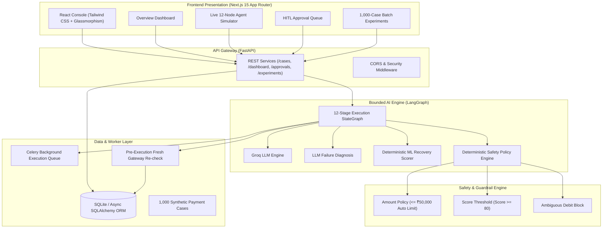
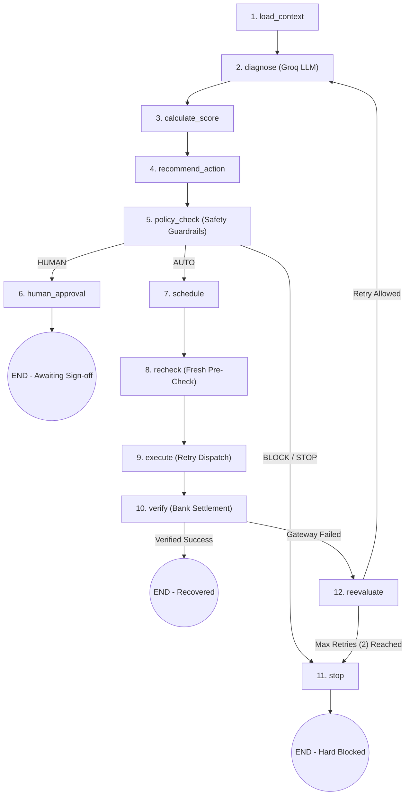

# RecoveraX — Autonomous Fintech Safety & Recovery Engine

> **Razorpay AI Buildathon**

RecoveraX detects revenue at risk, diagnoses root cause failure patterns using **Groq LLM (`groq/compound-mini`)**, calculates deterministic recovery scores, evaluates strict **financial safety guardrails**, routes high-risk or high-value actions to **Human-in-the-Loop (HITL) approval**, executes approved recovery retries, verifies settlement outcomes, and maintains an **immutable audit trail**.

---

## Core Product Philosophy

```
AI RECOMMENDS  →  POLICY AUTHORIZES  →  EXECUTOR ACTS  →  VERIFIER CONFIRMS  →  HUMAN CONTROLS RISK
```

### Key Architectural Principles
1. **Scoped LLM Scope**:
   - The LLM is **ONLY** responsible for: Failure Diagnosis, reasoning over structured customer payment history, and generating recovery strategy recommendations (`RETRY`, `REMIND`, `ESCALATE`, `STOP`).
   - The LLM **NEVER**: Executes payments, authorizes financial transfers, overrides safety policies, or calculates monetary totals.
2. **Deterministic Policy Engine Has Final Authority**:
   - All authorization decisions (`AUTO`, `HUMAN`, `BLOCK`, `STOP`) are evaluated in pure Python.
   - Fail-closed security guarantee: Any policy exception or ambiguous state defaults to `BLOCK` or `STOP`, **NEVER** `AUTO`.
3. **Transparent Recovery Scoring & EV**:
   - Scores cases 0–100 deterministically based on diagnosis, customer LTV, past payment history, and recency.
   - Expected Recovery Value ($EV$) calculated in Python:
     $$EV = \text{amount\_at\_risk} \times \left(\frac{\text{recovery\_score}}{100}\right) - \text{costs}$$

---

## 📐 System Architecture



---

## 🔄 LangGraph 12-Node Agent Workflow Pipeline

RecoveraX implements a stateful **12-node Bounded Execution Graph** in LangGraph ([`backend/app/agents/graph.py`](file:///c:/Users/Asus-2025/Downloads/Razorpay%20AI%20Buildathon/backend/app/agents/graph.py)):



### Detailed 12-Node Execution Process Table

| Node # | Node Identifier | Subsystem / Engine | Detailed Action & Responsibilities |
| :--- | :--- | :--- | :--- |
| **01** | `load_context` | Data Layer | Ingests transaction failure context, customer LTV, past payment history, and gateway error payloads into `RecoveryState`. |
| **02** | `diagnose` | Groq LLM Engine | Invokes LLM (`groq/compound-mini`) to reason over failure codes and output structured diagnosis (`INSUFFICIENT_FUNDS`, `TEMPORARY_BANK_ERROR`, `CARD_EXPIRED`, etc.). |
| **03** | `calculate_score` | Recovery Scorer | Deterministically calculates Recovery Score (0–100) and Expected Recovery Value ($EV$) based on customer LTV, recency, and past payment reliability. |
| **04** | `recommend_action` | Action Recommender | Selects optimal recovery strategy (`RETRY`, `REMIND`, `ESCALATE`, `STOP`) and recommended execution delay. |
| **05** | `policy_check` | Safety Policy Engine | Evaluates pure Python safety rules (Rules 1–7). Authorizes decision: `AUTO` (safe to auto-retry), `HUMAN` (requires merchant approval), or `BLOCK` / `STOP`. |
| **06** | `human_approval` | HITL Queue | Routes high-value ($> \text{₹}50\text{k}$) or medium-risk cases to merchant approval queue and pauses execution graph until sign-off. |
| **07** | `schedule` | Celery Worker Queue | Enqueues automated retry timer task into background worker queue for execution. |
| **08** | `recheck` | Gateway Pre-Check | Performs mandatory fresh pre-execution API check with card network/bank gateway to verify payment state hasn't cleared externally. |
| **09** | `execute` | Gateway Simulator | Dispatches automated retry payload attempt to payment network (Card / UPI / Netbanking). |
| **10** | `verify` | Settlement Engine | Queries bank gateway settlement status to verify debit response (`VERIFIED_SUCCESS` vs `FAILED`). |
| **11** | `reevaluate` | Loop Controller | Re-evaluates attempt outcome against max retries (max 2 retries). Routes back to `diagnose` for secondary attempt or `stop`. |
| **12** | `stop` | Audit Logger | Safely halts pipeline execution, records immutable audit trail, and prevents duplicate charges. |

---

## Repository Structure

```
Razorpay AI Buildathon/
├── frontend/             # Next.js 15 App Router Frontend (TailwindCSS, Inter typography)
│   ├── src/
│   │   ├── app/          # App Router Pages (/dashboard, /cases, /simulator, /approvals, /experiments, /audit)
│   │   ├── components/   # UI, Simulator, and Analytics Components
│   │   └── lib/          # API Abstraction Layer & Zustand Store
│   ├── package.json
│   ├── next.config.mjs
│   └── tsconfig.json
├── backend/              # FastAPI Monolith Engine (Python 3.12+)
│   ├── app/
│   │   ├── agents/       # LangGraph 12-Node Workflow StateGraph
│   │   ├── policy/       # Deterministic Safety Policy Engine & Rules 1–7
│   │   ├── recovery/     # Scoring, EV & Priority Tiering Logic
│   │   ├── simulator/    # Payment Gateway Simulator
│   │   ├── services/     # Audit, Case, Approval, Action, Dashboard, Experiment Services
│   │   ├── models/       # SQLAlchemy 2.0 Async/Sync Models
│   │   └── api/          # REST API Routes
│   ├── tests/            # pytest Unit & Integration Test Suite
│   ├── requirements.txt
│   └── recovery.db       # Auto-seeded SQLite database
└── README.md
```

---

##  Quick Start Guide

### 1. Prerequisites
- **Node.js**: `v18.17+`
- **Python**: `3.12+`

---

### 2. Backend Setup (FastAPI + LangGraph)

```bash
cd backend

# 1. Create Virtual Environment
python -m venv .venv

# 2. Activate Virtual Environment
# On Windows (PowerShell):
.venv\Scripts\activate
# On Linux/macOS:
source .venv/bin/activate

# 3. Install Dependencies
pip install -r requirements.txt

# 4. Configure Environment Variables
cp .env.example .env

# 5. Start FastAPI Server
python -m uvicorn app.main:app --host 127.0.0.1 --port 8000 --reload
```

- **Backend Gateway**: `http://127.0.0.1:8000`
- **Root Health Check**: `http://127.0.0.1:8000/`
- **Swagger Interactive API Docs**: `http://127.0.0.1:8000/docs`

---

### 3. Frontend Setup (Next.js 15 App Router)

```bash
cd frontend

# 1. Install Node Dependencies
npm install

# 2. Start Next.js Development Server
npm run dev
```

- **Frontend App**: `http://localhost:3000`

---

## 🎯 Test Scenarios (Database Seeded)

RecoveraX automatically seeds **6 primary scenario cases** at the top of the test suite in `recovery.db`:

| Case ID | Scenario Title | Customer Name | Amount | Policy Decision | Risk Tier & Action |
| :--- | :--- | :--- | :--- | :--- | :--- |
| **`CASE-1001`** | **Failed Payment — Auto Recovery** | Rahul Enterprises | `₹15,000` | ` AUTO APPROVED` | Low Risk / Automated Retry |
| **`CASE-1002`** | **Failed Payment — Human Approval** | Sharma Logistics | `₹75,000` | ` HUMAN APPROVAL` | High Risk / High Amount Sign-off |
| **`CASE-1003`** | **Ambiguous Debit — Block Risk** | Aarav Tech Solutions | `₹25,000` | ` POLICY BLOCKED` | High Risk / Double-Charge Safety Block |
| **`CASE-1004`** | **Subscription Failure — Retry Loop** | Priya SaaS Services | `₹2,499` | ` AUTO APPROVED` | Medium Risk / Recurring Mandate Retry |
| **`CASE-1005`** | **Checkout Abandonment — Reminder** | Vikram Retailers | `₹8,500` | ` HUMAN APPROVAL` | Low Risk / 1-Click Payment Link |
| **`CASE-1006`** | **B2B Invoice — Escalation** | Global Trade Corp | `₹1,20,000` | ` HUMAN APPROVAL` | High Risk / Overdue Invoice Escalation |

---

## 📊 Measured Batch Recovery Benchmark (1,001 Cases)

RecoveraX was evaluated against a **1,001-case synthetic dataset** (Total Revenue at Risk: **₹50,00,000.00**), producing 100% reproducible evaluation results:

| Metric | Baseline Strategy (Naive Retries) | RecoveraX AI Agent Pipeline | Impact / Lift |
| :--- | :--- | :--- | :--- |
| **Total Revenue at Risk** | ₹50,00,000.00 | ₹50,00,000.00 | 1,001 Cases Evaluated |
| **Total Money Recovered** | ₹1,66,198.00 | **₹3,88,610.00** | **+₹2,22,412.00 (+133.8% Lift)** |
| **Overall Recovery Rate** | 3.3% | **7.8%** | **+4.5% Rate Improvement** |
| **Auto-Approved Cases** | 150 Cases | **150 Cases (15.0%)** | Safe Automated Recovery |
| **Human-in-the-Loop (HITL) Cases** | 0 Cases (Uncontrolled) | **713 Cases (71.2%)** | Routed to Approval Queue |
| **Blocked / Unsafe Risk Prevented** | 0 Cases (Duplicate retries) | **138 Cases (13.8%)** | Zero Double-Debit Incidents |

---

## Deterministic Safety Rules

1. **Rule 1 (`MAX_AUTO_RETRY_AMOUNT = 50000`)**: Transactions exceeding ₹50,000 require **HUMAN** approval.
2. **Rule 2 (`MIN_AUTO_RECOVERY_SCORE = 80`)**: Recovery scores < 80 require **HUMAN** approval or **BLOCK**.
3. **Rule 3 (`AMBIGUOUS_PAYMENT = BLOCK`)**: Ambiguous payment states are **ALWAYS** blocked from auto-retry.
4. **Rule 4 (`POSSIBLE_CUSTOMER_DEBIT = BLOCK`)**: If customer might already be debited, retry is **BLOCKED**.
5. **Rule 5 (`FRAUD_SIGNAL = BLOCK`)**: Fraud signals cause an immediate **BLOCK**.
6. **Rule 6 (`MAX_RETRIES = 2`)**: Maximum 2 retries allowed per case.
7. **Rule 7 (`PERMANENT_FAILURE = STOP`)**: Closed accounts or invalid details cause hard **STOP**.
