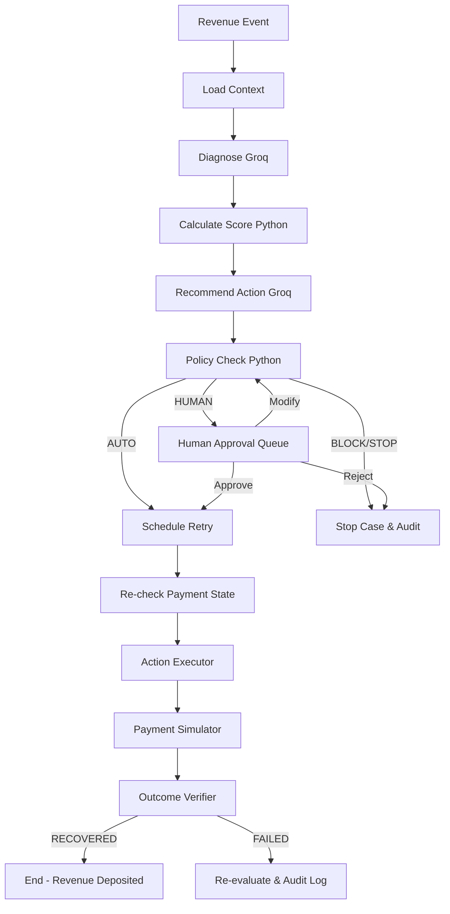

# AI Revenue Recovery Engine — Backend MVP

**Razorpay AI Buildathon — Track 3: AI Revenue Recovery**

An autonomous revenue recovery backend engine with deterministic financial safety guardrails and Human-in-the-Loop (HITL) approval routing.

---

## 🏛️ Core Product Philosophy

```
AI RECOMMENDS  →  POLICY AUTHORIZES  →  EXECUTOR ACTS  →  VERIFIER CONFIRMS  →  HUMAN CONTROLS RISK
```

- **Groq LLM (`llama-3.3-70b-versatile`)**: Diagnoses root causes, recommends actions (`RETRY`, `REMIND`, `ESCALATE`, `STOP`), and explains reasoning over structured context.
- **Deterministic Policy Engine**: Has **final authority**. Enforces thresholds (`MAX_AUTO_RETRY_AMOUNT=5000`, `MIN_AUTO_RECOVERY_SCORE=80`, `MAX_RETRIES=2`), blocks ambiguous/double-debit states, and fails closed (`BLOCK`).
- **Human-in-the-Loop (HITL)**: Escalates medium-risk and high-value transactions for human sign-off (`Approve`, `Reject`, `Modify`). Human modifications re-evaluate policy safety rules before execution.

---

## 📐 LangGraph Workflow Architecture



---

## 🛠️ Tech Stack

- **Framework**: FastAPI (Async Python 3.12+)
- **LLM**: Groq API (`ChatGroq`, `llama-3.3-70b-versatile`) via `langchain-groq`
- **Orchestration**: LangGraph
- **Database**: PostgreSQL (SQLAlchemy 2.x, psycopg, Alembic) with SQLite fallback
- **Task Queue**: Celery + Redis
- **Testing**: pytest

---

## 🚀 Quick Start

### 1. Local Setup
```bash
cd backend
python -m venv venv
# On Windows:
venv\Scripts\activate
# On Linux/macOS:
source venv/bin/activate

pip install -r requirements.txt
cp .env.example .env

# Run FastAPI app (automatically seeds 1,000 synthetic cases + demo cases)
uvicorn app.main:app --host 0.0.0.0 --port 8000 --reload
```

### 2. Run Test Suite
```bash
pytest
```

### 3. Run via Docker Compose
```bash
docker-compose up --build
```

---

## 📡 Key REST API Endpoints

| Method | Endpoint | Description |
| :--- | :--- | :--- |
| `GET` | `/health` | System health check & configuration |
| `GET` | `/dashboard/metrics` | Dynamic dashboard KPI metrics |
| `GET` | `/cases` | Filterable list of recovery cases |
| `GET` | `/cases/{id}` | Detailed recovery case information |
| `POST` | `/cases/{id}/analyze` | Run LangGraph diagnosis & policy pipeline |
| `GET` | `/approvals` | Queue of cases requiring human sign-off |
| `POST` | `/cases/{id}/approve` | Human operator approves action |
| `POST` | `/cases/{id}/reject` | Human operator rejects action |
| `POST` | `/cases/{id}/modify` | Human operator modifies action/delay |
| `POST` | `/cases/{id}/recheck` | Re-checks gateway payment state |
| `POST` | `/cases/{id}/execute` | Executes retry via simulator & verifies deposit |
| `POST` | `/cases/{id}/stop` | Manually stops recovery case |
| `GET` | `/cases/{id}/audit` | Immutable audit log trail |
| `POST` | `/experiments/run` | Run batch A/B experiment (Baseline vs AI Agent) |

---

## 🎯 Seeded Demo Cases

- `CASE-1021`: ₹2,000 FAILED_PAYMENT (`TEMPORARY_BANK_ERROR`) → Score 87, Policy `AUTO` → Retry `SUCCESS`
- `CASE-1032`: ₹75,000 FAILED_PAYMENT (`BANK_TIMEOUT`) → Score 82, Policy `HUMAN` → Approval Queue
- `CASE-1048`: ₹25,000 FAILED_PAYMENT (`AMBIGUOUS_STATE`) → Policy `BLOCK` → Hard-blocked
- `CASE-1088`: ₹2,000 SUBSCRIPTION_FAILURE → Retry #1 Fail, Max 2 retries
- `CASE-1102`: ₹75,000 OVERDUE_INVOICE (18 days overdue) → Policy `HUMAN` → Escalate
