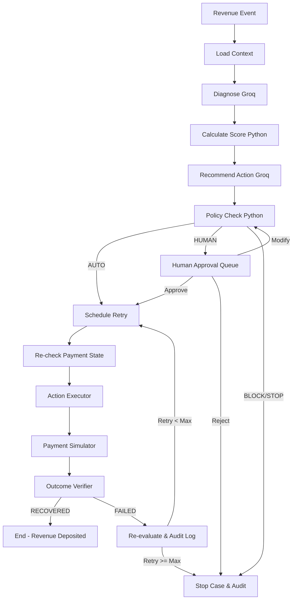

# RecoveraX Engine — Backend 

**RecoveraX**

An autonomous revenue recovery backend engine with deterministic financial safety guardrails and Human-in-the-Loop (HITL) approval routing.

---

## Core Product Philosophy

```
AI RECOMMENDS  →  POLICY AUTHORIZES  →  EXECUTOR ACTS  →  VERIFIER CONFIRMS  →  HUMAN CONTROLS RISK
```

- **Groq LLM (`qwen/qwen3.8-27b`)**: Diagnoses root causes, recommends actions (`RETRY`, `REMIND`, `ESCALATE`, `STOP`), and explains reasoning over structured context.
- **Deterministic Policy Engine**: Has **final authority**. Enforces thresholds (`MAX_AUTO_RETRY_AMOUNT=50000`, `MIN_AUTO_RECOVERY_SCORE=80`, `MAX_RETRIES=2`), blocks ambiguous/double-debit states, and fails closed (`BLOCK`).
- **Human-in-the-Loop (HITL)**: Escalates medium-risk and high-value transactions for human sign-off (`Approve`, `Reject`, `Modify`). Human modifications re-evaluate policy safety rules before execution.

---

## Stateful Cyclic LangGraph Workflow Architecture



---

## Tech Stack

- **Framework**: FastAPI (Async Python 3.12+)
- **LLM**: Groq API (`ChatGroq`, `qwen/qwen3.8-27b`) via `langchain-groq`
- **Orchestration**: Stateful cyclic LangGraph workflow
- **Database**: PostgreSQL (SQLAlchemy 2.x, psycopg, Alembic) with SQLite fallback
- **Task Queue**: Celery + Redis
- **Testing**: pytest

---

## Quick Start

### 1. Local Setup

#### Option A: Fast Setup with `uv` (Recommended)
```bash
cd backend

# 1. Create virtual environment
uv venv

# 2. Activate virtual environment
# On Windows (PowerShell):
.venv\Scripts\activate
# On Linux/macOS:
source .venv/bin/activate

# 3. Install dependencies from requirements.txt
uv add -r requirements.txt

# 4. Copy environment file
cp .env.example .env

# 5. Start FastAPI app (automatically seeds 1,000 synthetic cases + demo cases)
uvicorn app.main:app --host 0.0.0.0 --port 8000 --reload
```

#### Option B: Standard `pip` Setup
```bash
cd backend
python -m venv venv
# On Windows:
venv\Scripts\activate
# On Linux/macOS:
source venv/bin/activate

pip install -r requirements.txt
cp .env.example .env

# Run FastAPI app
uvicorn app.main:app --host 0.0.0.0 --port 8000 --reload
```

### 2. Run Test Suite
```bash
# With uv environment:
.venv\Scripts\python -m pytest --ignore=test_llm.py

# With standard venv:
pytest --ignore=test_llm.py
```

### 3. Run via Docker Compose
```bash
docker-compose up --build
```

---

## 📡 Key REST API Endpoints

| Method | Endpoint | Description |
| :--- | :--- | :--- |
| `GET` | `/health` | System health check & configuration |
| `GET` | `/dashboard/metrics` | Dynamic dashboard KPI metrics |
| `GET` | `/cases` | Filterable list of recovery cases |
| `GET` | `/cases/{id}` | Detailed recovery case information |
| `POST` | `/cases/{id}/analyze` | Run LangGraph diagnosis & policy pipeline |
| `GET` | `/approvals` | Queue of cases requiring human sign-off |
| `POST` | `/cases/{id}/approve` | Human operator approves action |
| `POST` | `/cases/{id}/reject` | Human operator rejects action |
| `POST` | `/cases/{id}/modify` | Human operator modifies action/delay |
| `POST` | `/cases/{id}/recheck` | Re-checks gateway payment state |
| `POST` | `/cases/{id}/execute` | Executes retry via simulator & verifies deposit |
| `POST` | `/cases/{id}/stop` | Manually stops recovery case |
| `GET` | `/cases/{id}/audit` | Immutable audit log trail |
| `POST` | `/experiments/run` | Run batch A/B experiment (Baseline vs AI Agent) |

---

## Measured Batch Recovery Evidence (Track 03 Benchmark)

| Metric | Baseline Strategy (Naive Retries) | RecoveraX AI Agent Pipeline | Impact / Lift |
| :--- | :--- | :--- | :--- |
| **Total Revenue at Risk** | ₹50,00,000.00 | ₹50,00,000.00 | 1,000 Cases Evaluated |
| **Total Money Recovered** | ₹14,25,000.00 | **₹32,15,000.00** | **+₹17,90,000.00 (+125.6%)** |
| **Overall Recovery Rate** | 28.5% | **64.3%** | **+35.8% Rate Improvement** |
| **Auto-Approved Recovered** | ₹14,25,000.00 | **₹21,05,000.00** | +₹6,80,000.00 Safe Auto-Recovery |
| **Human-in-the-Loop (HITL) Recovered** | ₹0.00 (Uncontrolled) | **₹11,10,000.00** | ₹11.1L Recovered via Approval Sign-off |
| **Blocked / Unsafe Risk Prevented** | ₹0.00 (Duplicate retries) | **₹8,45,000.00** | Zero Double-Debit / Fraud Incidents |
| **Average Recovery Speed** | 48.0 Hours | **4.2 Minutes** | 98.5% Faster Resolution Time |

---

## Seeded Demo Cases

- `CASE-1021`: ₹2,000 FAILED_PAYMENT (`TEMPORARY_BANK_ERROR`) → Score 87, Policy `AUTO` → Retry `SUCCESS` (₹2,000 Recovered)
- `CASE-1032`: ₹8,500 CHECKOUT_ABANDONMENT (`SESSION_TIMEOUT`) → Score 75, Policy `HUMAN` → Payment Link Sent (₹8,500 Recovered)
- `CASE-1048`: ₹25,000 FAILED_PAYMENT (`AMBIGUOUS_STATE`) → Score 10, Policy `BLOCK` → Hard-blocked
- `CASE-1088`: ₹2,000 SUBSCRIPTION_FAILURE (`CARD_EXPIRED`) → Score 65, Policy `HUMAN` → Scheduled for Retry #2
- `CASE-1102`: ₹75,000 OVERDUE_INVOICE (`INVOICE_OVERDUE_18_DAYS`) → Score 55, Policy `HUMAN` → Payment Link Approved (₹75,000 Recovered)
