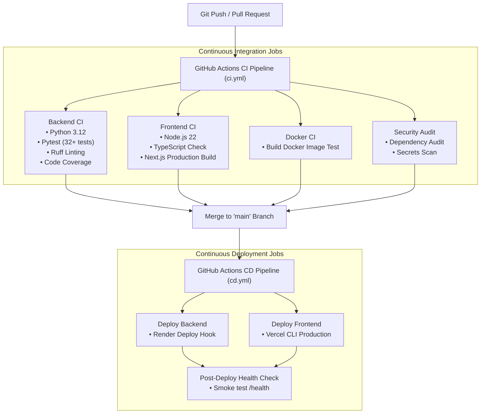

# RecoverAX CI/CD Pipeline Documentation

Welcome to the **RecoverAX Continuous Integration and Continuous Deployment (CI/CD)** documentation. This document details the automated workflow architecture, GitHub Actions setup, deployment strategy for Render (Backend) and Vercel (Frontend), environment secret management, and local verification steps.

---

## 🏗️ Architecture Overview

The CI/CD setup automates code validation, security checks, Docker image building, and production deployment across both frontend and backend stacks.



---

## ⚙️ GitHub Actions Workflows

The repository includes four workflow files in `.github/workflows/`:

| Workflow File | Trigger Events | Purpose & Included Jobs |
| :--- | :--- | :--- |
| **`ci.yml`** | `push` to any branch, `pull_request` to `main`, manual dispatch | **Continuous Integration**: Runs `pytest` suite, `ruff` code formatting/linting, TypeScript compilation check (`tsc --noEmit`), Next.js production build check, Docker image build test, and dependency security audits. |
| **`cd.yml`** | `push` to `main`, manual dispatch | **Continuous Deployment**: Triggers automated backend deployment on Render via Deploy Hook, deploys frontend to Vercel production via CLI, and executes post-deployment smoke health checks. |
| **`keepalive.yml`** | Every 14 minutes (`cron`) | **Backend Ping**: Keeps cloud backend instances active 24/7 on Render free tier by sending `/health` pings. |
| **`nightly.yml`** | Every day at 04:00 UTC (`cron`) | **Nightly Quality Suite**: Runs complete test suite with coverage reporting across the entire repository. |

---

## 🔑 Secret Configuration Guide

To enable automated deployment and backend health checks in GitHub Actions, configure the following secrets in **GitHub Repository Settings → Secrets and variables → Actions**:

### Required Repository Secrets

| Secret Name | Category | Description & Instructions |
| :--- | :--- | :--- |
| `RENDER_DEPLOY_HOOK_URL` | Backend CD | The Deploy Hook URL generated in Render Dashboard (Service → Settings → Deploy Hook). Triggering this URL initiates an immediate zero-downtime deployment. |
| `VERCEL_TOKEN` | Frontend CD | Personal Access Token generated in Vercel Account Settings (Tokens). Allows GitHub Actions to push builds. |
| `VERCEL_ORG_ID` | Frontend CD | Vercel Organization / Team ID (found in `.vercel/project.json` or Organization Settings). |
| `VERCEL_PROJECT_ID` | Frontend CD | Vercel Project ID assigned to RecoverAX frontend application. |
| `BACKEND_URL` | Post-Deploy / Keepalive | Base URL of deployed backend service (e.g., `https://recoverax-backend.onrender.com`). Used for health ping check. |

> [!NOTE]
> If any deployment secret is missing (e.g., in a community fork), the deployment job will gracefully log an informational message and pass without failing the CI pipeline.

---

## 🚀 Deployment Platforms

### Backend: Render
- **Config**: [`render.yaml`](file:///c:/Users/Asus-2025/Downloads/Razorpay%20AI%20Buildathon/render.yaml)
- **Runtime**: Python 3.12 (`uvicorn app.main:app`)
- **Health Check Endpoint**: `/health`
- **Docker Support**: Alternative deployment via [`backend/Dockerfile`](file:///c:/Users/Asus-2025/Downloads/Razorpay%20AI%20Buildathon/backend/Dockerfile).

### Frontend: Vercel
- **Config**: [`vercel.json`](file:///c:/Users/Asus-2025/Downloads/Razorpay%20AI%20Buildathon/vercel.json) & [`frontend/vercel.json`](file:///c:/Users/Asus-2025/Downloads/Razorpay%20AI%20Buildathon/frontend/vercel.json)
- **Framework**: Next.js (App Router, TailwindCSS, React 19)
- **Build Command**: `cd frontend && npm run build`

---

## 🧪 Local Verification & Pre-Commit Testing

Before pushing code to GitHub, developers can run local validation commands matching the CI pipeline:

### 1. Backend Verification
```bash
cd backend

# 1. Activate virtual environment
# Windows:
.\.venv\Scripts\python -m pytest tests/

# macOS / Linux:
# source .venv/bin/activate && pytest tests/

# 2. Run Ruff Linting
ruff check app tests
```

### 2. Frontend Verification
```bash
cd frontend

# 1. Run TypeScript Type Check
npx tsc --noEmit

# 2. Test Production Build
npm run build
```

### 3. Docker Container Build Verification
```bash
cd backend
docker build -t recoverax-backend:local .
```

---

## 🛡️ Recommended Branch Protection Rules

For optimal quality control, configure Branch Protection Rules on the `main` branch in GitHub Repository Settings:

1. Go to **Settings → Branches → Add branch protection rule**.
2. Set Branch name pattern to `main`.
3. Check **Require status checks to pass before merging**:
   - `Backend Pytest, Lint & Coverage`
   - `Frontend TypeScript & Next.js Build`
   - `Backend Docker Image Verification`
4. Check **Require linear history** or **Require branches to be up to date before merging**.
