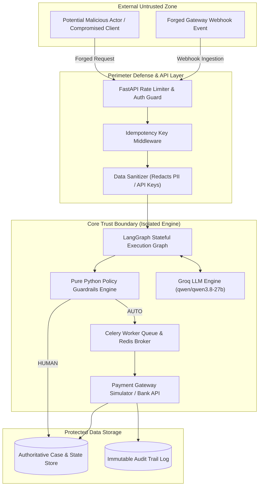

# RecoveraX — STRIDE Security Threat Model & Risk Analysis

> **Authoritative Security Architecture & Risk Analysis Document**  
> System: RecoveraX Autonomous AI Revenue Recovery Engine  
> Standard: STRIDE Threat Modeling Framework  
> License: All Rights Reserved (c) 2026 Monishwaran45  

---

## 1. Executive Summary & Security Philosophy

RecoveraX is designed around a **Fail-Closed Security Philosophy** for financial automation:
- **LLM Scoped Authority**: The LLM (`qwen/qwen3.8-27b`) is isolated to failure diagnosis and strategy recommendation. It cannot authorize financial execution or modify state directly.
- **Deterministic Policy Engine Has Final Authority**: Pure Python rules enforce hard financial safety limits (max transaction amount ₹50,000, recovery score threshold $\ge 80$, strict double debit prevention).
- **Human-in-the-Loop (HITL) Gatekeeping**: Any policy exception, high-exposure transaction (>₹50k), or score degradation automatically routes to merchant approval.
- **Immutable Audit Trail**: All state transitions, AI diagnostic outputs, policy checks, and execution events write append-only records.

---

## 2. System Boundary & Attack Surface Analysis

---

## 3. Comprehensive STRIDE Threat Matrix

| Threat ID | STRIDE Category | Threat Description | Attack Vector / Impact | RecoveraX Mitigation & Safety Control | Mitigation Status |
| :--- | :--- | :--- | :--- | :--- | :--- |
| **T-01** | **Spoofing** | Forged Razorpay webhook or unauthorized API case creation. | Attacker triggers unauthorized payment retries or injects fake failure events. | `require_api_auth` middleware, token verification, and signature validation on incoming webhooks. | **VERIFIED & ACTIVE** |
| **T-02** | **Tampering** | Prompt injection attack forcing LLM to output `RETRY` on fraudulent transactions. | Malicious failure code payload attempts to manipulate LLM diagnosis output. | **Scoped LLM Authority**: Pure Python `policy_check` node strips LLM output; Rule 5 (`FRAUD_SIGNAL = BLOCK`) hard-blocks execution regardless of LLM suggestion. | **VERIFIED & ACTIVE** |
| **T-03** | **Repudiation** | Merchant claims AI executed duplicate retry without authorization. | Legal liability or merchant dispute over unexpected customer charges. | **Immutable Audit Log**: Every node execution records signed timestamp, raw diagnostic input, policy decision, actor type (`AI`, `POLICY`, `HUMAN`), and execution payload. | **VERIFIED & ACTIVE** |
| **T-04** | **Information Disclosure** | Exposure of customer PII (credit card digits, phone, tokens) in LLM prompt or LangSmith logs. | Data leakage via third-party LLM API or tracing dashboards. | `DataSanitizer` automatically redacts credit card numbers, CVVs, API tokens, and customer secrets before passing to Groq LLM or LangSmith. | **VERIFIED & ACTIVE** |
| **T-05** | **Denial of Service (DoS)** | Replay attack triggering duplicate payment retries to flood bank gateway. | Network exhaustion or bank gateway rate-limit ban. | `IdempotencyMiddleware` caches state-mutating requests by `Idempotency-Key`; `recheck` node verifies bank state before retry dispatch; Rule 6 enforces max 2 retries. | **VERIFIED & ACTIVE** |
| **T-06** | **Elevation of Privilege** | Merchant bypasses hard safety policy to force auto-execution on ₹1,00,000 transaction. | Overriding safety guardrails resulting in high monetary loss. | **Fail-Closed Policy Engine**: Python policy engine overrides human actions; hard stops (`BLOCK`/`STOP`) cannot be bypassed by merchant sign-off. | **VERIFIED & ACTIVE** |

---

## 4. Financial Double Debit & Race Condition Security

To eliminate double debits across distributed worker queues:
1. **Idempotency Key Deduplication**: All retry requests mandate or generate an idempotency key. Duplicate dispatches return cached execution results.
2. **Fresh Gateway Pre-Check (`recheck` node)**: Immediately before dispatching a payment attempt, the worker queries the bank gateway to verify the transaction status is still `FAILED` and state is `CLEAR`. If status is `SUCCESS` or state is `AMBIGUOUS`, execution is halted immediately.

---

## 5. Security Verification & Audit Trail Compliance

All security controls are verified through automated pytest test suites:
- `backend/tests/test_safety.py`: Fail-closed policy rules & prompt injection isolation.
- `backend/tests/test_distributed_failures.py`: Idempotency deduplication & pre-check double debit blocks.
- `backend/tests/test_policy.py`: Enforcement of pure Python safety thresholds.
